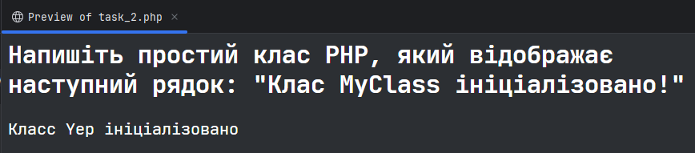
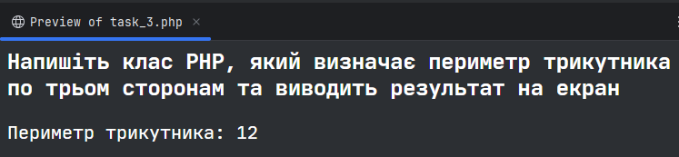
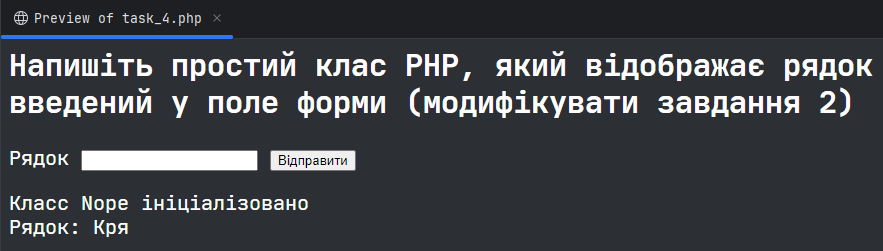
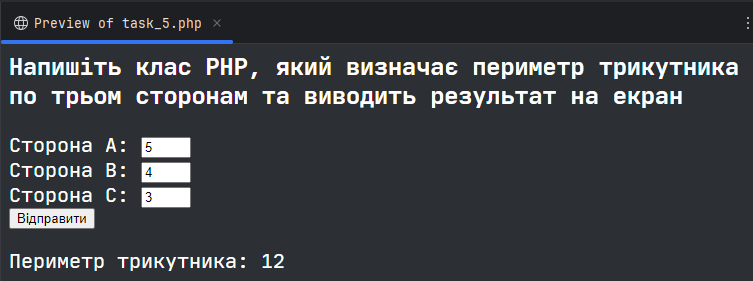

# Практична робота №8
**Жеревчук Сергій, 34 група**

## Завдання 2 __[Код](src/task_2.php)__
Напишіть простий клас PHP, який відображає наступний рядок: "Клас MyClass ініціалізовано!"

## Завдання 3 __[Код](src/task_3.php)__
Напишіть клас PHP, який визначає периметр трикутника по трьом сторонам та виводить результат на екран

## Завдання 4 __[Код](src/task_4.php)__
Напишіть простий клас PHP, який відображає рядок введений у поле форми (модифікувати завдання 2)

## Завдання 5 __[Код](src/task_5.php)__
Напишіть клас PHP, який визначає периметр трикутника по трьом сторонам та виводить результат на екран. Дані вводяться у поля форми (модифікувати завдання 3)

